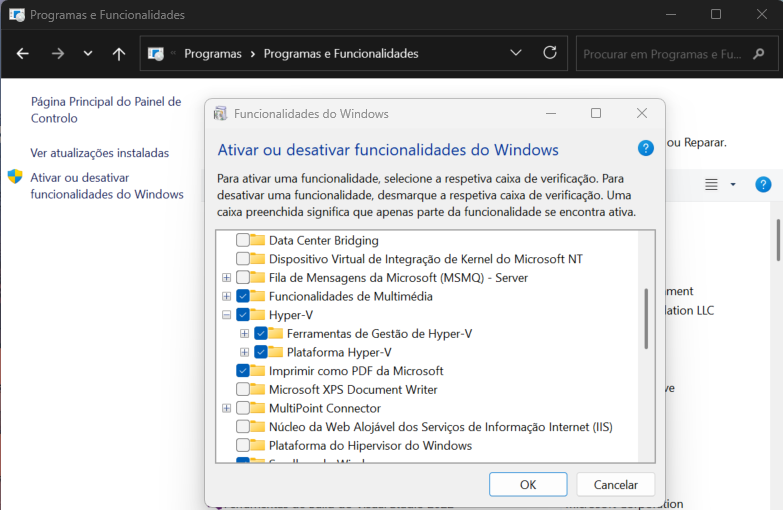

# Setting Up a Kali Linux VM for TryHackMe on Hyper-V

This guide outlines how to set up a Kali Linux virtual machine using **Hyper-V** on Windows, and how to connect it to **TryHackMe** via OpenVPN.

[TryHackMe](https://tryhackme.com/) is a browser-based cyber security training platform, with learning content covering all skill levels from the complete beginner to the seasoned hacker.

---


## Hyper-v Setup

To run Hyper-v, make sure to meet these requirements:

- Windows 10 Pro, Enterprise, or Education (Home edition does not support Hyper-V natively).

- 64-bit processor with Second Level Address Translation (SLAT).

- At least 4 GB of RAM.

- Virtualization enabled in BIOS/UEFI.


In the control Painel, go to **Programs and Features** and, in the left pane, click **Turn Windows features on or off**. Click the check Hyper-V, click Ok and restart the PC.



## Creating the Kali Linux VM

First, download the kali-linux image in [kali-linux image](https://www.kali.org/get-kali/#kali-platforms) **Installer Images**.

Then, it's necessary to have an virtual network that allows the connection between the Kali VM and TryHackMe. to make this possible I created an a **New virtual network switch** in Hyper-V, an External Network connected to my Wi-Fi.

After this, I create the Kali VM using the virtual network and the kali.iso iamge and configurated the machine following [kali-VM-Configuration](https://www.kali.org/docs/installation/hard-disk-install/).

## Connecting to TryHackMe

Download the VPN configuration file in the **Access** tab of TryHackMe account. 

To share this file with the Kali VM I use [filetransfer.io](https://filetransfer.io/) and send it to my email. 
Then open my email in the Kali VM, in FireFox and download the ovpn file.

In the terminal, I created a directory for this file, to make it easier to run.
```bash
mkdir ~/vpn
mv ~/Downloads/username.ovpn ~/vpn/
``` 

Then run the following command:

```bash
sudo openvpn ~/vpn/username.ovpn
``` 
The connection was established and in the TryHackMe Access page I could see the IP.

----

## Q&A

- Do I need to keep the terminal tab open after running the VPN command?

Yes — the VPN connection is tied to the terminal session where the openvpn command is running. If the terminal is closed, the connection to the TryHackMe network will be terminated, and the Kali VM will lose access to the labs.


- Does the VPN connection persist after rebooting? 

No — the VPN connection does not persist between reboots or shutdowns. Each time that the Kali VM start, to access TryHackMe, it's necesary to re-run the following command:

```bash
sudo openvpn ~/vpn/username.ovpn
``` 

This initiates a new VPN session, which is required to access the TryHackMe private network for the active rooms.


