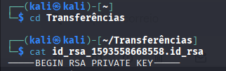
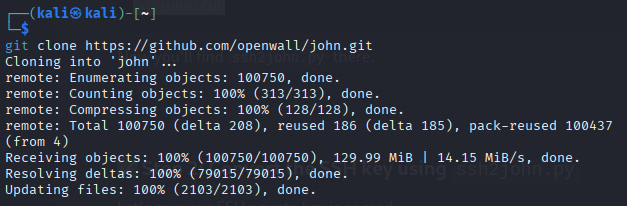
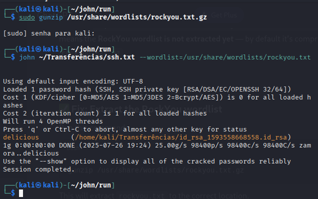
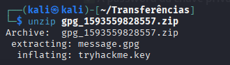
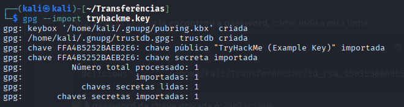
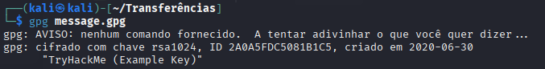
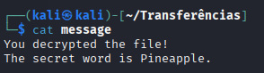

# Introduction

This is my resolution of Encryption - Crypto 101 room of TryHackMe.

# Task 1: What will this room cover?

This room will cover:

- Why cryptography matters for security and CTFs.
- The two main classes of cryptography and their uses.
- RSA, and some of the uses of RSA.
- 2 methods of Key Exchange.
- Notes about the future of encryption with the rise of Quantum Computing.

> **Answer:** `No answer needed`

# Task 2: Key terms

I agree not to complain too much about how theory heavy this room is.

> **Answer:** `No answer needed`

Are SSH keys protected with a passphrase or a password?

> **Answer:** `passphrase`  
Separate to the key, a passphrase is similar to a password and used to protect a key.

# Task 3: Why is Encryption important?

What does SSH stand for?
> **Answer:** `Secure Shell`  

How do webservers prove their identity?
> **Answer:** `certificates`  
When you connect to your bank, there’s a certificate that uses cryptography to prove that it is actually your bank rather than a hacker.

What is the main set of standards you need to comply with if you store or process payment card details?
> **Answer:** `PCI-DSS`  
Standards like PCI-DSS state that the data should be encrypted both at rest (in storage) AND while being transmitted. If you’re handling payment card details, you need to comply with these PCI regulations.

# Task 4: Crucial Crypto Maths

What's 30 % 5?
> **Answer:** `0`  

What's 30 % 5?
> **Answer:** `4`  

What's 118613842 % 9091
> **Answer:** `3565`  

# Task 5: Types of Encryption

Should you trust DES? Yea/Nay
> **Answer:** `Nay`  
Symmetric encryption uses the same key to encrypt and decrypt the data. Examples of Symmetric encryption are DES (Broken) and AES.

What was the result of the attempt to make DES more secure so that it could be used for longer?
> **Answer:** `Triple DES`  
Triple Data Encryption Standard (Triple DES or 3DES) is a symmetric block cipher-based cryptography standard that uses fixed length keys with three passes of the DES algorithm.

Source: [The Triple DES Intro: Triple Data Encryption Standard](https://www.splunk.com/en_us/blog/learn/triple-des-data-encryption-standard.html)

Is it ok to share your public key? Yea/Nay
> **Answer:** `Yea`  
Asymmetric encryption uses a pair of keys, one to encrypt and the other in the pair to decrypt. Examples are RSA and Elliptic Curve Cryptography. Normally these keys are referred to as a public key and a private key. Data encrypted with the private key can be decrypted with the public key, and vice versa. Your private key needs to be kept private, hence the name.

# Task 6: RSA - Rivest Shamir Adleman

p = 4391, q = 6659. What is n?
> **Answer:** `29239669`   
The key variables that you need to know about for RSA in CTFs are p, q, m, n, e, d, and c.
“p” and “q” are large prime numbers, “n” is the product of p and q.

I understand enough about RSA to move on, and I know where to look to learn more if I want to.
> **Answer:** `No answer needed`

# Task 7: Establishing Keys Using Asymmetric Cryptography

I understand how keys can be established using Public Key (asymmetric) cryptography.
> **Answer:** `No answer needed`

# Task 8: Digital signatures and Certificates

What can you use to verify that a file has not been modified and is the authentic file as the author intended?
> **Answer:** `Digital Signature`   
Digital signatures are a way to prove the authenticity of files, to prove who created or modified them

# Task 9: SSH Authentication

I recommend giving this a go yourself. Deploy a VM, like Linux Fundamentals 2 and try to add an SSH key and log in with the private key.
> **Answer:** `No answer needed`

Download the SSH Private Key attached to this room.
> **Answer:** `No answer needed`

What algorithm does the key use?
> **Answer:** `RSA`

Crack the password with John The Ripper and rockyou, what's the passphrase for the key?

1. First, I open my Kali-linux vm and connected to TryHackMe via VPN (see more in [Setup Kali VM for TryHackMe](https://shushizinho.github.io/posts/SetupKali/)).

2. Then, download the SSH Private Key file and visualise the content using `cat`command:

_Download and view of the SSH Private Ket file_

3. To crack the password using John the Ripper I cloned the repo using: 

_Clone Jhon The Ripper repo_

4. Using Rockyou to crack it:

_Using rockyou.txt and getting the password_

I used the rockyou.txt wordlist because it's one of the most popular real-world password lists, leaked from a historical data breach. It contains millions of common passwords that people actually use, making it highly effective for dictionary-based attacks in tools like John the Ripper.

> **Answer:** `delicious`

# Task 10: Explaining Diffie Hellman Key Exchange

I understand how Diffie Hellman Key Exchange works at a basic level
> **Answer:** `No answer needed`

# Task 11: PGP, GPG and AES

Time to try some GPG. Download the archive attached and extract it somewhere sensible.
> **Answer:** `No answer needed`

Time to try some GPG. Download the archive attached and extract it somewhere sensible.

1. Download the file and unziping the task files:

_Unziping GPG files_

2. Then, import the key:

_Importing tryhackme.key_

3. And decrypt the file:

_Decrypt the GPG File_

4. Finally, viewing the file content:

_Message decoded_

> **Answer:** `Pineapple`

This task demonstrates the use of GPG (GNU Privacy Guard), which is a free implementation of the OpenPGP standard. GPG allows to secure encrypt and decrypt files using a hybrid encryption approach — it uses asymmetric encryption (via public/private key pairs) to securely exchange the symmetric AES key, which is then used to encrypt the actual data.

In this challenge, the .gpg file was encrypted using the recipient’s public key. By importing the provided tryhackme.key (private key) into GPG, I was able to decrypt the file and retrieve the hidden message. This showcases a real-world application of encryption used in secure email, file sharing, and digital signatures, where confidentiality and authenticity are essential.

# Task 12: The Future - Quantum Computers and Encryption

I understand that quantum computers affect the future of encryption. I know where to look if I want to learn more.
> **Answer:** `No answer needed`

