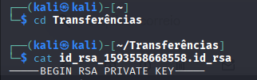
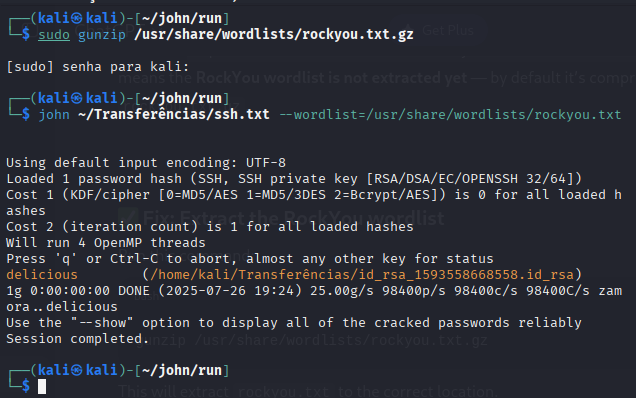
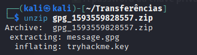
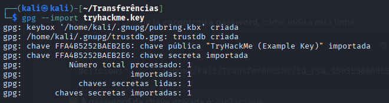
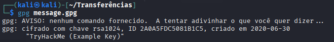
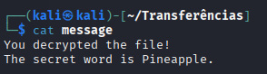

# Introduction

This is my resolution of Encryption - Crypto 101 room of TryHackMe.

# Task 9: SSH Authentication

Open my Kali-linux vm and connected to TryHackMe via VPN (see more in [Setup Kali VM for TryHackMe](https://shushizinho.github.io/posts/SetupKali/)).

Dowload the RSA TryHackMe file 

To crack the password using John the Ripper I cloned the repo using: 

Using Rockyou to crack it:

As it shows, the password is "delicious".

# Task 10: Explaining Diffie Hellman Key Exchange

Resume: 

# Task 11: PGP, GPG and AES

Unziping the task files:

Then, import the key:

And decrypt the file:

Finally, viewing the file content:

