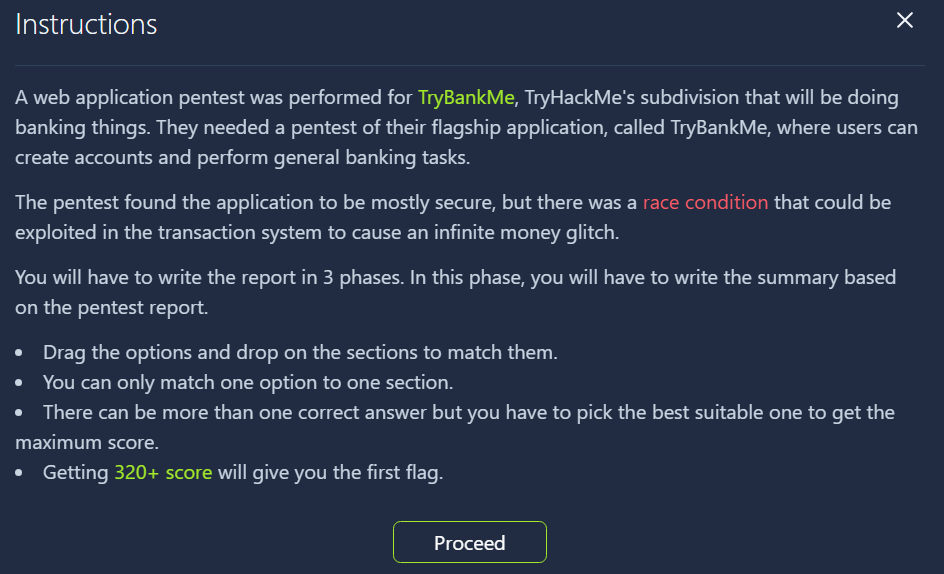
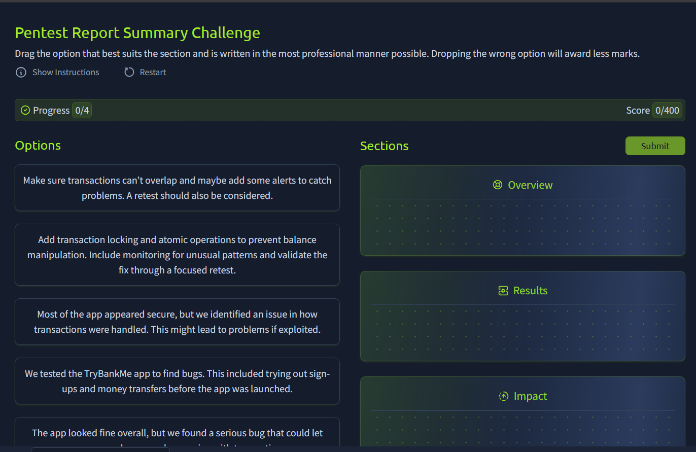
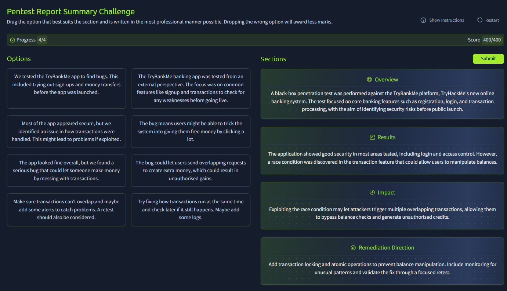
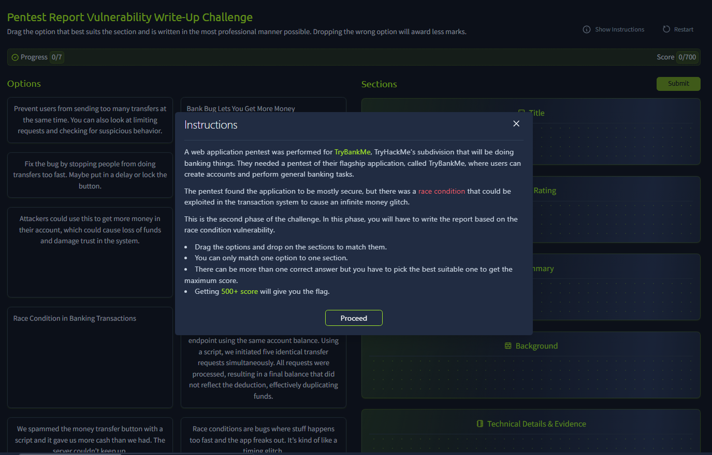
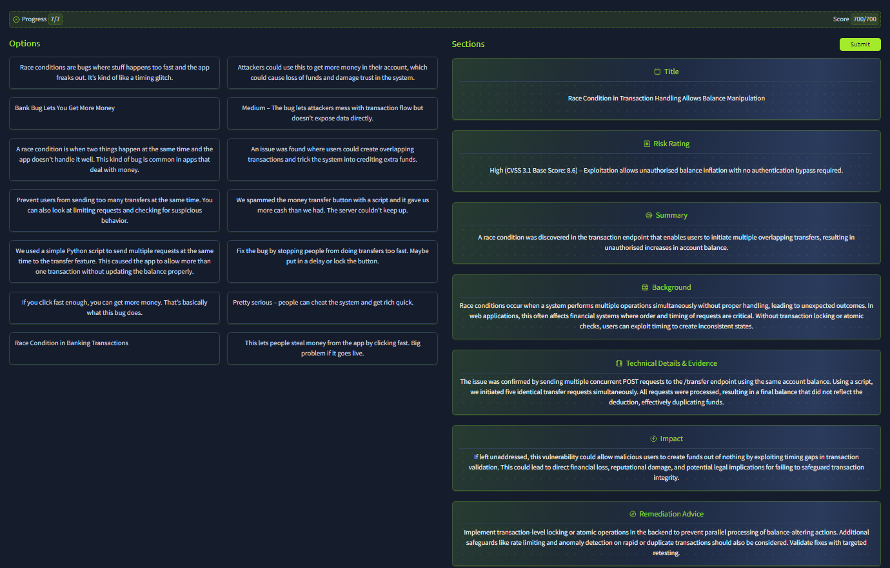
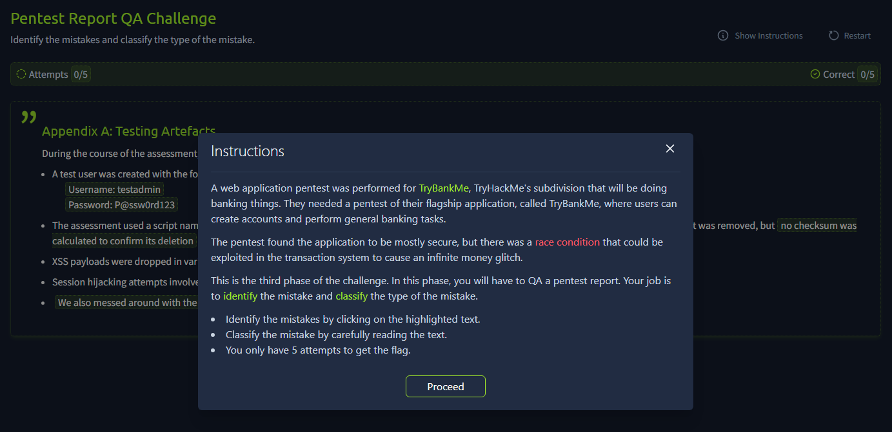

# Introduction

This is my walkthrough of the "Writing Pentest Reports" room on TryHackMe, where I learned the essential skills for creating professional penetration testing reports that effectively communicate security findings to both technical and non-technical stakeholders.

# Task 1: What will this room cover?

The room provides comprehensive coverage of pentest report writing fundamentals.

I am ready to learn about writing a professional pentest report!
> **Answer:** `No answer needed`

# Task 2: The Anatomy of a Pentest Report

Understanding the target audience is crucial for effective report writing. The questions here focus on identifying key stakeholders and report structure.

Which stakeholder should 80% of your report be aimed towards?
> **Answer:** `Technical`  
While pentest reports serve multiple audiences, the primary consumers are technical staff who need detailed information to understand and remediate vulnerabilities. This includes system administrators, developers, and security engineers who will implement the fixes.

Which section of the report is for extra information that can sometimes help security stakeholders better understand what coverage was achieved and the next steps that should be followed?
> **Answer:** `Appendices` 
Appendices serve as supplementary material that provides additional context without cluttering the main report. They're particularly valuable for including technical details, tool outputs, and evidence that support the findings.

# Task 3: Report Section 1: Summary

This task challenged me to write an effective executive summary. After reviewing the instructions and examining the site interface, I crafted a summary that balances technical accuracy with business impact.

<figure class="text-center">
  
  <figcaption><em></em>Pentest Report Summary Challenge Instructions</figcaption>
</figure>

Instructions:

<figure class="text-center">
  
  <figcaption><em></em>Pentest Report Summary Challenge View</figcaption>
</figure>

My approach focused on creating a summary that follows the standard structure of Overview, Results, Impact, and Remediation Direction:

<figure class="text-center">
  
  <figcaption><em></em>Results of Pentest Report Summary Challenge</figcaption>
</figure>

- **Overview**: A black-box penetration test was performed against the TryBankMe platform, TryHackMe's new online banking system. The test focused on core banking features such as registration, login, and transaction processing, with the aim of identifying security risks before public launch.

- **Results**: The application showed good security in most areas tested, including login and access control. However, a race condition was discovered in the transaction feature that could allow users to manipulate balances.

- **Impact**: Exploiting the race condition may let attackers trigger multiple overlapping transactions, allowing them to bypass balance checks and generate unauthorised credits.

- **Remediation Direction**: Add transaction locking and atomic operations to prevent balance manipulation. Include monitoring for unusual patterns and validate the fix through a focused retest.

I structured the summary to provide a clear narrative flow from what was tested, what was found, what it means for the business, and what should be done about it. This format allows executives to quickly grasp the situation while providing enough technical context for informed decision-making.

After submitting my summary, I successfully obtained the flag, indicating that my approach effectively balanced technical accuracy with executive-level communication.

# Task 4: Report Section 2: Vulnerability Write-Ups

The vulnerability write-up section requires detailed technical documentation that balances comprehensiveness with clarity. This task tested my ability to structure technical findings in a professional format.

<figure class="text-center">
  
  <figcaption><em></em>Pentest Report Vulnerability Write-Up Challenge Instructions</figcaption>
</figure>

After analyzing the requirements and considering the target audience, I developed a comprehensive vulnerability write-up:

<figure class="text-center">
  
  <figcaption><em></em>Results of Pentest Report Vulnerability Write-Up Challenges</figcaption>
</figure>

- **Title**: Race Condition in Transaction Handling Allows Balance Manipulation

Risk Rating
High (CVSS 3.1 Base Score: 8.6) – Exploitation allows unauthorised balance inflation with no authentication bypass required.

- **Summary**: A race condition was discovered in the transaction endpoint that enables users to initiate multiple overlapping transfers, resulting in unauthorised increases in account balance.

- **Background**: Race conditions occur when a system performs multiple operations simultaneously without proper handling, leading to unexpected outcomes. In web applications, this often affects financial systems where order and timing of requests are critical. Without transaction locking or atomic checks, users can exploit timing to create inconsistent states.

- **Technical Details & Evidence**: The issue was confirmed by sending multiple concurrent POST requests to the /transfer endpoint using the same account balance. Using a script, we initiated five identical transfer requests simultaneously. All requests were processed, resulting in a final balance that did not reflect the deduction, effectively duplicating funds.

- **Impact**: If left unaddressed, this vulnerability could allow malicious users to create funds out of nothing by exploiting timing gaps in transaction validation. This could lead to direct financial loss, reputational damage, and potential legal implications for failing to safeguard transaction integrity.

- **Remediation Advice**: Implement transaction-level locking or atomic operations in the backend to prevent parallel processing of balance-altering actions. Additional safeguards like rate limiting and anomaly detection on rapid or duplicate transactions should also be considered. Validate fixes with targeted retesting.

#### My decision-making process:

 - Title Selection: I chose a descriptive title that immediately conveys both the technical issue and its potential impact.
- Risk Rating: I assigned a High rating because financial manipulation vulnerabilities have severe business consequences.
- Background Section: I included this to help non-experts understand the concept before diving into technical details.
- Evidence Documentation: I provided specific technical details about the exploitation method to help developers understand exactly what needs fixing.
- Impact Assessment: I focused on business consequences rather than just technical implications.
- Remediation Strategy: I offered both immediate fixes and longer-term improvements to provide a comprehensive security approach.

After submitting my vulnerability write-up, I successfully obtained the flag, confirming that my structured approach met the professional standards expected for pentest reporting.

# Task 5: Report Section 3: Appendices

Which appendix will be vital for the blue team to discern if activity is from a pentest or an actual attack?
> **Answer:** `Assessment Artefacts`  
Assessment Artefacts contain the specific indicators, timestamps, source IPs, and other technical details that blue team members can use to distinguish legitimate pentest activities from actual malicious attacks. This appendix serves as a crucial reference for security operations teams who need to correlate their monitoring data with authorized testing activities.

# Task 6: Styling Guides and Report QA

Quality assurance is essential for maintaining professional credibility. This task tested my ability to identify and correct common reporting mistakes.

<figure class="text-center">
  
  <figcaption><em></em> Instructions of Pentest Report QA Challenge</figcaption>
</figure>

The errors I identified and corrected:

**Unprofessional Language**
— `Password:P@ssw0rd123:` - Credentials should never be shown in clear text, even for test accounts.
— `Pwned throug a stored injection`  - 'Pwned' is slang and inappropriate in professional reporting.
— `We also messed arounf with the transation queue`  - 'Messed around' is informal and should be replaced with a more professional phrase like 'conducted timing tests'.

**Spelling & Grammar**
— `"Burp Suite" was used extensivly` - 'Burp Suite' was used extensivly The word 'extensivly' is a misspelling, it should be 'extensively'.

#### My QA approach:

1. Language Review: I looked for informal terms, slang, and unprofessional expressions.
2. Security Sensitivity: I identified information that shouldn't be exposed (like cleartext passwords).
3. Spelling and Grammar: I conducted a systematic review for common errors.
4. Consistency Check: I ensured terminology and formatting remained consistent throughout.

# Task 7: Conclusion

This room provided invaluable insights into professional pentest report writing. The key takeaways include understanding your audience, structuring information logically, maintaining professional standards, and ensuring that technical findings translate into actionable business intelligence.

#### Key lessons learned:

- **Audience-focused writing**: Tailor content to primarily serve technical stakeholders while remaining accessible to business users
- **Structured approach**: Use consistent formatting and logical flow to guide readers through complex technical information
- **Professional presentation**: Maintain high standards for language, accuracy, and detail to preserve credibility
- **Actionable recommendations**: Always provide clear, implementable solutions alongside problem identification

I understand how to write great and professional pentest reports!
> **Answer:** `No answer needed`
